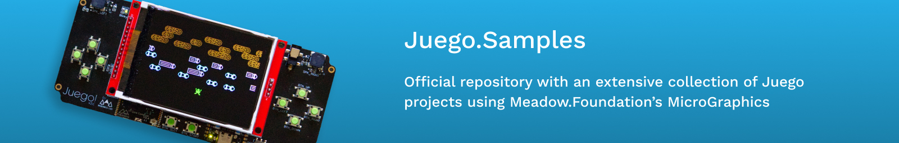
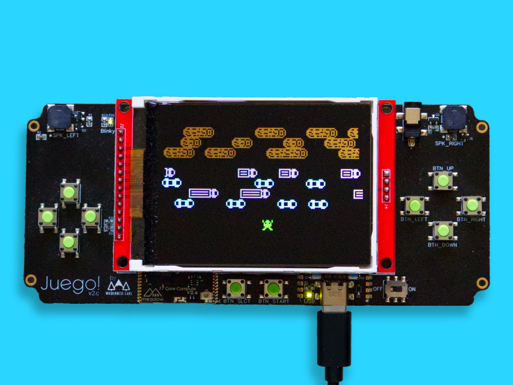
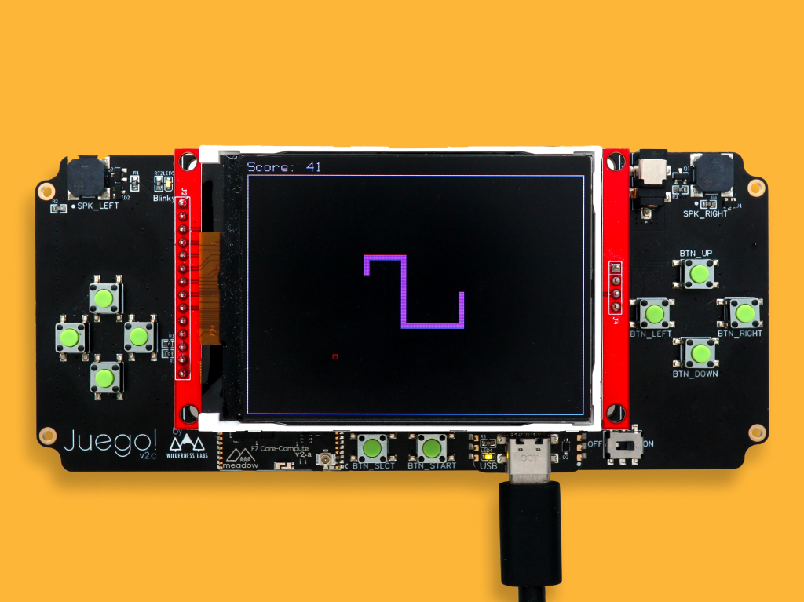
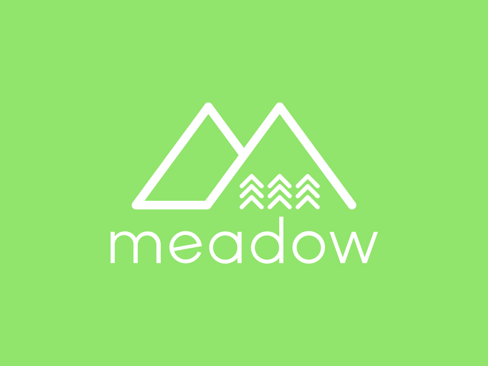
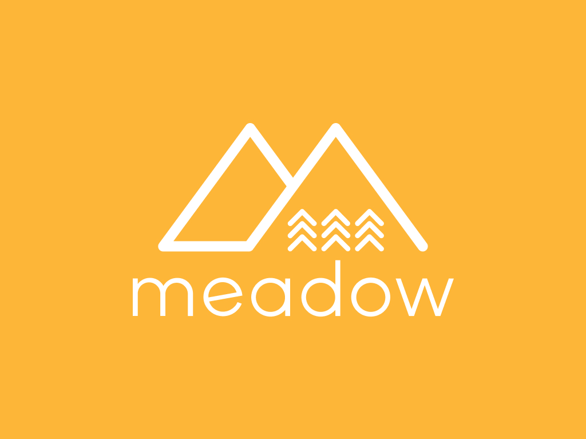

# Juego.Samples

Samples for the Wilderness Labs Jeugo IoT Accelerator

## Contents
* [Getting Started](#getting-started)
* [Project Samples](#project-samples)
* [Support](#support)

## Getting Started

Before running any of the project samples below, make sure to go through the [Meadow.Cloud basics](http://developer.wildernesslabs.co/Meadow/Meadow.OS/Updates/) guides showing you how to provision your device, how to download and apply an update from Meadow, and make/publish a package. 

## Project Samples

<table>
    </tr>
        <tr>
        <td>
             
            Getting startd with Juego with and basic sample 
            <a href="Source/">Source Code</a>
        </td>
        <td>
             
            Run/play frogger on a Juego board 
            <a href="Source/Froggit/">Source Code</a>
        </td>
        <td>
             
            Run/play snake on a Juego board 
            <a href="Source/Snake/">Source Code</a>
        </td>
    </tr>
    <tr>
        <td>
             
            Run/play Span4 on a Juego board 
            <a href="Source/Span4/">Source Code</a>
        </td>
        <td>
             
            Run/play Tetraminoes on a Juego board 
            <a href="Source/Tetraminoes/">Source Code</a>
        </td>
        <td>
             
            Run/play snake on a Juego board 
            <a href="Source/Eyeball/">Source Code</a>
        </td> 
    </tr>
    <tr>
        <td>
            
&nbsp;&nbsp;&nbsp;&nbsp;&nbsp;&nbsp;&nbsp;&nbsp;&nbsp;&nbsp;&nbsp;&nbsp;&nbsp;&nbsp;&nbsp;&nbsp;&nbsp;&nbsp;&nbsp;&nbsp;&nbsp;&nbsp;&nbsp;&nbsp;&nbsp;&nbsp;&nbsp;&nbsp;&nbsp;&nbsp;&nbsp;&nbsp;

        </td>
        <td>
            
&nbsp;&nbsp;&nbsp;&nbsp;&nbsp;&nbsp;&nbsp;&nbsp;&nbsp;&nbsp;&nbsp;&nbsp;&nbsp;&nbsp;&nbsp;&nbsp;&nbsp;&nbsp;&nbsp;&nbsp;&nbsp;&nbsp;&nbsp;&nbsp;&nbsp;&nbsp;&nbsp;&nbsp;&nbsp;&nbsp;&nbsp;&nbsp;

        </td>
        <td>
            
&nbsp;&nbsp;&nbsp;&nbsp;&nbsp;&nbsp;&nbsp;&nbsp;&nbsp;&nbsp;&nbsp;&nbsp;&nbsp;&nbsp;&nbsp;&nbsp;&nbsp;&nbsp;&nbsp;&nbsp;&nbsp;&nbsp;&nbsp;&nbsp;&nbsp;&nbsp;&nbsp;&nbsp;&nbsp;&nbsp;&nbsp;&nbsp;

        </td>
    </tr>
</table>

## Support

Having trouble building/running these projects? 
* File an [issue](https://github.com/WildernessLabs/Meadow.Desktop.Samples/issues) with a repro case to investigate, and/or
* Join our [public Slack](http://slackinvite.wildernesslabs.co/), where we have an awesome community helping, sharing and building amazing things using Meadow.